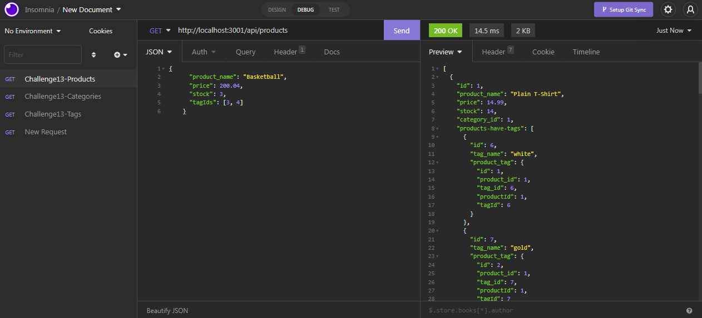

# E-Commerce Platform
  

  ## Description

  The application is designed to manage an inventory of products for e-commerce businesses. The application accepts GET, PUT, POST, and DELETE HTTP methods as ways of updating the database. The database consists of product, tag, category, and productTag models which are used to keep track of the stock of items.
  
  The application runs using the sequelize library.

## Table of Contents

- [Installation](#installation)
- [Usage](#usage)
- [License](#License)
- [Contributing](#contributing)
- [Tests](#tests)
- [Questions](#questions)
- [Screenshots](#screenshots)
- [Links](#links)

  ## Installation

  The application requires sequelize, dotenv, and express packages to run.

  ## Usage

  After running npm install, run npm start from the command line  to start the application.

  ## License

  This project is licensed under the GNU GPLv3 license. Read more about the license here:
  https://choosealicense.com/licenses/gpl-3.0/
  

  ## Contributing

  Please fork and submit a pull request.

  ## Tests

  Test using a variety of inputs.

  ## Questions

  You can reach me at GitHub; my username is nathanh635 and my profile is here: https://github.com/nathanh635. 
  You can also email me at nathanh635@gmail.com. 
  
  ## Screenshots

  Below is a screenshot of the tested application.

  
## Links

  Repository: https://github.com/nathanh635/E-Commerce-Platform
  
  Link to walkthrough video: https://drive.google.com/drive/folders/1JgyT0ULC8ouPEMYY_-QppBtg9-6-sxui?usp=sharing

